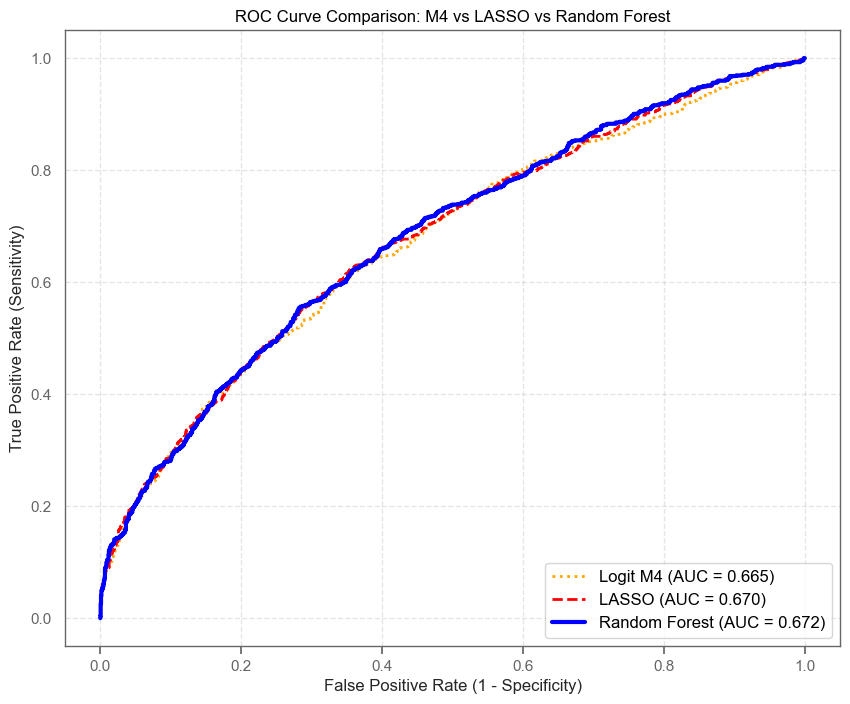
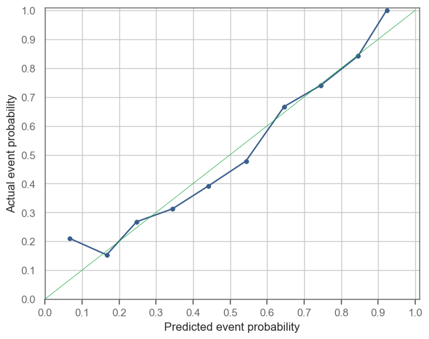

# Summary Report: Predicting High-Growth Firms
**Date:** February 2026
**To:** Data Science Team Leaders & Senior Management
**From:** Yllke Berisha & Bo Wang
**Subject:** Finding fast growing firms

---

## 1. Executive Summary

### Objective
The primary goal of this analysis is to identify potential high-growth firms using 2012 financial data to guide venture capital investment decisions for 2013. We aim to maximize the capture of lucrative opportunities while managing the cost of due diligence.

### Key Result
The **Random Forest (RF)** model demonstrated superior performance compared to Logistic Regression and LASSO models. It achieved the highest Area Under the Curve (**AUC ≈ 0.67**) and, most importantly, minimized the expected financial loss under our specific business constraints.

### Recommendation
We recommend adopting an **aggressive investment strategy** utilizing the Random Forest model with a probability threshold of approximately **18%**.
* **Implication:** We should invest in (or investigate) any firm that the model predicts has at least a 18% chance of high growth.
* **Trade-off:** This strategy accepts higher due diligence costs (False Positives) to ensure we rarely miss a "unicorn" (minimizing False Negatives).

### Sector Insight
The model shows higher efficacy in the **Services** sector compared to Manufacturing, suggesting immediate deployment for service-based portfolio allocation.

---

## 2. Business Problem & Loss Function

### The "Why": Defining Risk Appetite
In Venture Capital, the cost of missing a "unicorn" is significantly more damaging than the cost of investigating a non-starter. A missed opportunity represents lost 10x-100x ROI, whereas a false alarm only costs the administrative fee of due diligence.

To reflect this reality, we quantified the risk appetite using the following **Loss Function**:
* **False Negative (FN) Cost = 10**: The penalty for missing a high-growth firm.
* **False Positive (FP) Cost = 2**: The penalty for investigating a firm that turns out to be low-growth.
* **Ratio:** 5:1 (Risk-Seeking).

### Confusion Matrix: Cost-Benefit Context
*The table below illustrates the business impact of our prediction outcomes.*

| | **Predicted: Low Growth** (Don't Invest) | **Predicted: High Growth** (Invest) |
| :--- | :--- | :--- |
| **Actual: Low Growth** | **True Negative**   *Cost = 0*   (Correctly ignored) | **False Positive**   *Cost = 2*   (Wasted Due Diligence Fee) |
| **Actual: High Growth**| **False Negative**   *Cost = 10*   (Missed "Unicorn" Opportunity) | **True Positive**   *Cost = 0*   (Successful Investment) |

---

## 3. Data & Methodology

### Data Integrity & Decisions
* **Sample Selection:** We utilized a cross-section of 2012 financial data, filtering for active firms with sales between €1,000 and €10 million. This excludes micro-enterprises (too volatile) and large giants (growth saturation), focusing on the prime segment for VC investment.
* **Target Definition:** "Fast Growth" is defined as sales growth exceeding **20%** in the subsequent year (2013). This cutoff relies on the sample mean/median logic derived from the distribution analysis.
* **Models Tested:**
    1.  **Logit:** Establishing a linear baseline.
    2.  **LASSO:** For rigorous feature selection and handling multicollinearity.
    3.  **Random Forest:** To capture complex, non-linear market dynamics.

### Model Performance Comparison
*Random Forest outperforms linear models in minimizing business loss.*

| Model | Number of Coefficients | CV RMSE | CV AUC | CV Threshold | CV Expected Loss |
| :--- | :--- | :--- | :--- | :--- | :--- |
| **M1** | 12.0 | 0.450373 | 0.606183 | 0.186479 | 1.383428 |
| **M2** | 19.0 | 0.444576 | 0.640386 | 0.151181 | 1.383853 |
| **M3** | 36.0 | 0.439932 | 0.660361 | 0.160749 | 1.364023 |
| **M4** | 79.0 | 0.437121 | 0.664911 | 0.154932 | 1.367280 |
| **M5** | 153.0 | 0.436867 | 0.667483 | 0.141282 | 1.354958 |
| **LASSO**| 110.0 | 0.436442 | 0.669907 | 0.155241 | 1.351983 |
| **RF** | NaN | **0.435108**| **0.672103**| 0.165901 | **1.341360** |

---

## 4. Modeling Results & Interpretation

### Why Random Forest Won
The Random Forest model succeeded because firm growth is rarely linear. It captured complex non-linear relationships—such as the "U-shape" effect where both very low and very high profit margins can signal different growth trajectories—that standard linear models missed.

### Key Drivers of Growth
The most influential predictors identified by the model were:
1.  **`d1_sales_mil_log`**: Past growth momentum is the strongest predictor of future performance.
2.  **`sales_mil`**: The scaling effect; current size impacts future growth potential.

#### Figure 1: Variable Importance Plot (Top 10)
*> Managers' View: What characteristics drive our predictions?*

#### Figure 2: ROC Curve Comparison
*> Technical View: Demonstrating RF dominance across thresholds.*

---

## 5. The Decision Threshold

### When to "Pull the Trigger"
Standard classification uses a 50% threshold (i.e., "more likely than not"). However, given our high cost of missing winners (FN Cost = 10), a 50% threshold is too conservative.

We optimized the decision threshold to minimize total expected loss. The data dictates an **optimal threshold of ~18%**. This means if the model assigns a probability of success greater than 18%, the potential upside outweighs the risk of wasted due diligence.

#### Figure 3: Expected Loss Function (The "Check Mark")
*> Critical Visual: Showing why 18% is the optimal business decision point.*

#### Figure 4: Calibration Curve
*> Trust Validation: Ensuring the model's 20% probability truly means 20% risk.*

---

## 6. Industry Analysis & Conclusion

### Services vs. Manufacturing
We tested the model separately on two key sectors. The results indicate a split in performance:

| Industry | AUC | Optimal Threshold | Expected Loss |
| :--- | :--- | :--- | :--- |
| **Services** | **0.684** | **0.084** | **1.391** |
| Manufacturing | 0.623 | 0.151 | 1.326 |

### Industry-Specific Analysis
We analyzed Manufacturing (N=5,354) and Services (N=12,296) separately to assess if the model performs differently across sectors.

* **Performance Gap:** The model is significantly more effective at ranking Services firms (AUC 0.684) compared to Manufacturing firms (AUC 0.623). This suggests that high-growth service firms are easier to identify using our current financial predictors.
* **Risk Profile:** Interestingly, despite the better ranking ability (higher AUC) in Services, the expected loss per firm is slightly higher there (1.39 vs 1.33). This implies that Service firms might have a higher "base rate" of high growth (more opportunities to miss) or are inherently riskier.

### Strategic Implication
1.  **Services:** Adopt a very aggressive strategy (Threshold ~8%). The model is confident enough to recommend investing even when the probability is low, to avoid missing the many potential winners in this sector.
2.  **Manufacturing:** Maintain a more conservative threshold (~15%). The model struggles more here, so we require a higher probability before committing capital.