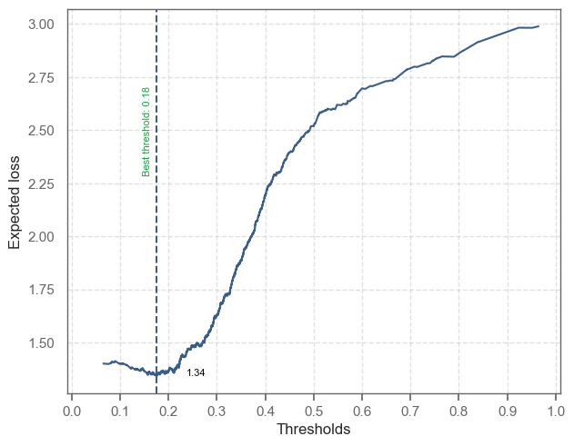
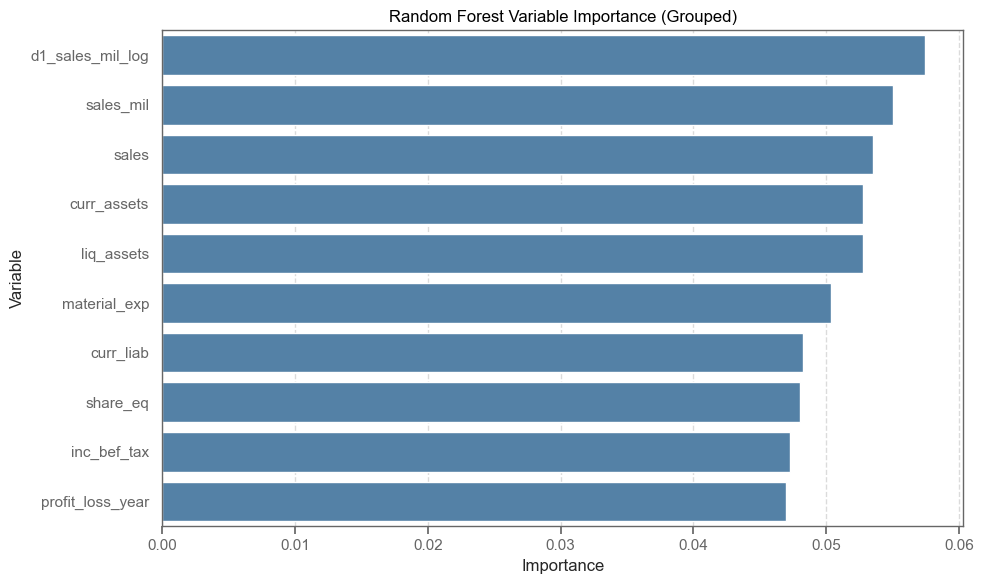
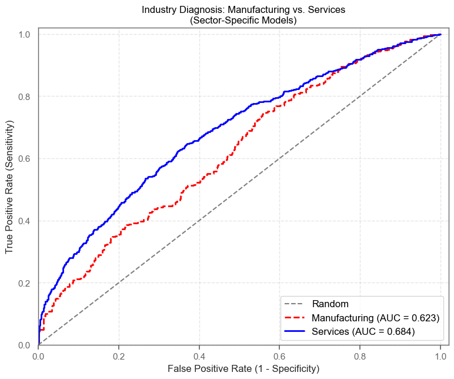

# Technical Report: Predicting High-Growth Firms
**Date:** February 2026
**To:** Data Science Team 
**From:** Yllke Berisha & Bo Wang
**Subject:** Finding fast growing firms
**Focus:** Methodology, feature engineering, and model selection details

---

**Code Repository:** https://github.com/yllkeberisha24/predicting-fast-growing-firms

---

## 1. Data Preparation & Sample Design

* **Source:** Bisnode panel data (2010-2015).
* **Sample Selection:** We utilized a cross-section of data from 2012 to predict growth outcomes. The sample was filtered to exclude inactive firms and those with unrealistic revenue figures (`sales_mil` constrained between 0.001 and 10 million EUR).
* **Target Definition (`fast_growth`):** Constructed using a forward-looking approach. A firm is classified as "high growth" (1) if its sales growth rate (CAGR) exceeds the sample-specific threshold (20%); otherwise 0.
* **Feature Engineering:**
    * **Predictors:** Key variables included firm size (`sales_mil`), past growth (`d1_sales_mil_log`), and CEO characteristics (age, gender).
    * **Data Quality:** Missing values in financial variables were handled using flag imputation (e.g., `flag_miss_ceo_age`) rather than dropping observations, preserving sample size.
    * **Winsorization:** Financial ratios were winsorized to limit the effect of outliers.

---

## 2. Modeling Strategy

We trained and evaluated three classes of models using **5-fold Cross-Validation (CV)** to ensure robustness:

1.  **Logistic Regression (M1-M5):** Ranging from simple linear predictors to complex interactions.
2.  **LASSO:** Employed for automated variable selection among the high-dimensional feature set.
3.  **Random Forest (RF):** Selected to capture non-linearities and interactions without manual specification.

**Loss Function Specification:**
To align the model with business objectives, we defined an asymmetric loss function:
* **False Positive (FP) Cost = 2:** Administrative/due diligence costs.
* **False Negative (FN) Cost = 10:** The high opportunity cost of missing a potential "unicorn."
* **Goal:** Minimize Expected Loss, rather than just maximizing Accuracy.

**Relevant Code Snippets:**
**Loss Function Specification:** To align the model's performance with business objectives, we defined an asymmetric loss function that penalizes missed opportunities more heavily than administrative errors:
```python
# Defined cost ratio based on business context
FP = 2   # Admin cost of reviewing a candidate
FN = 10  # Opportunity cost of missing a high-growth firm
cost_ratio = FN / FP

# Goal: Minimize Expected Loss per firm
# Loss = (FP * False_Positives + FN * False_Negatives) / N
```
**Random Forest Configuration:** To ensure robustness and prevent overfitting, we instantiated the Random Forest classifier with the following hyperparameters, choosing a conservative number of features per split (max_features=5) and a high minimum node size (min_samples_split=15):
```python
# Random Forest Classifier Setup
rf_model = RandomForestClassifier(
    n_estimators=500,        # Sufficient trees to stabilize predictions
    max_features=5,          # Controls correlation between trees
    min_samples_split=15,    # Regularization to prevent overfitting
    random_state=42,
    n_jobs=-1
)
```

---

## 3. Model Selection & Results

### 3.1 Performance Comparison
The Random Forest model outperformed both Logit and LASSO across all key metrics. As shown in **Table 1**, RF achieved the lowest Expected Loss (~1.34) and the highest predictive power (AUC 0.672).

**Table 1: Model Performance Summary (5-Fold CV)**

| Model | CV RMSE | CV AUC | Expected Loss |
| :--- | :--- | :--- | :--- |
| Logit M4 | 0.437 | 0.665 | 1.37 |
| LASSO | 0.436 | 0.670 | 1.35 |
| **Random Forest** | **0.435** | **0.672** | **1.34** |

### 3.2 Technical Diagnostics

**ROC Curve Comparison:**
Figure 1 demonstrates the dominance of the Random Forest model. The RF curve (blue) consistently envelopes the Logit (orange) and LASSO (red) curves, indicating superior true positive rates across various discrimination thresholds.


> **Figure 1:** The Random Forest model demonstrates superior discriminatory power across all thresholds.

**Optimal Threshold Selection:**
Due to the high cost of False Negatives (FN=10), the optimal decision threshold is significantly lower than the default 0.5. As illustrated in **Figure 2**, the Expected Loss function minimizes at a threshold of approximately **0.18**. This indicates an aggressive strategy: we accept more False Positives to ensure we capture the high-growth firms.


> **Figure 2:** The optimal threshold shifts left (~0.18) to minimize the high penalty of missing high-growth firms.

**Relevant Code Snippets:**

**Threshold Optimization Logic:** This logic iterates through cross-validation folds to identify the classification threshold that minimizes expected loss by maximizing the cost-sensitive Youden index.
```python
# Loop through thresholds to minimize Expected Loss
best_thresholds = []
expected_loss = []

for fold in cv_folds:
    # ... predict probabilities ...
    
    # Minimize loss function:
    optimal_threshold = sorted(list(zip(
        np.abs(tpr + (1 - prevalence)/(cost_ratio * prevalence) * (1 - fpr)),
        thresholds)), key=lambda i: i, reverse=True)[1]
        
    best_thresholds.append(optimal_threshold)
```

### 3.3 Variable Importance
To interpret the "black box" of the Random Forest, we analyzed feature importance. As shown in **Figure 3**, `sales_mil` (size) and `d1_sales_mil_log` (past growth) are the dominant predictors. Notably, when individual dummy variables are grouped, `ind2_cat` (Industry) emerges as a critical driver of growth probability.


> **Figure 3:** Size, past growth, and industry sector are the strongest predictors of future success.

---

## 4. Industry Analysis (Task 2)

We applied the best-performing model (Random Forest) to the Manufacturing and Services sectors independently to assess domain-specific performance.

* **Manufacturing:** AUC = 0.623 | Expected Loss = 1.326
* **Services:** AUC = 0.684 | Expected Loss = 1.391


> **Figure 4:** Sector Comparison ROC

**Interpretation of Results:**
* **Predictive Power (AUC):** As illustrated in **Figure 4**, the Services model (Blue line) achieves a significantly higher AUC (0.684) compared to Manufacturing (0.623). The Services curve consistently "bows" further toward the top-left corner, indicating that high-growth firms in the services sector signal their potential more clearly through standard financial metrics than manufacturing firms, where capital intensity and longer product cycles may obscure immediate growth signals.
* **Performance Gap:** The gap between the curves is particularly distinct in the lower-left quadrant (low False Positive Rate). This suggests that the highest-ranked candidates in Services are much more likely to be true high-growth firms than the top candidates in Manufacturing.
* **Strategic Implication:** The superior discriminatory power in Services justifies a more aggressive investment strategy. We calculated an optimal threshold of 0.084 for Services (compared to 0.151 for Manufacturing). This lower threshold allows us to capture more potential "unicorns" in the Services sector, as the model's higher precision helps mitigate the cost of False Positives better than in the noisier Manufacturing sector.